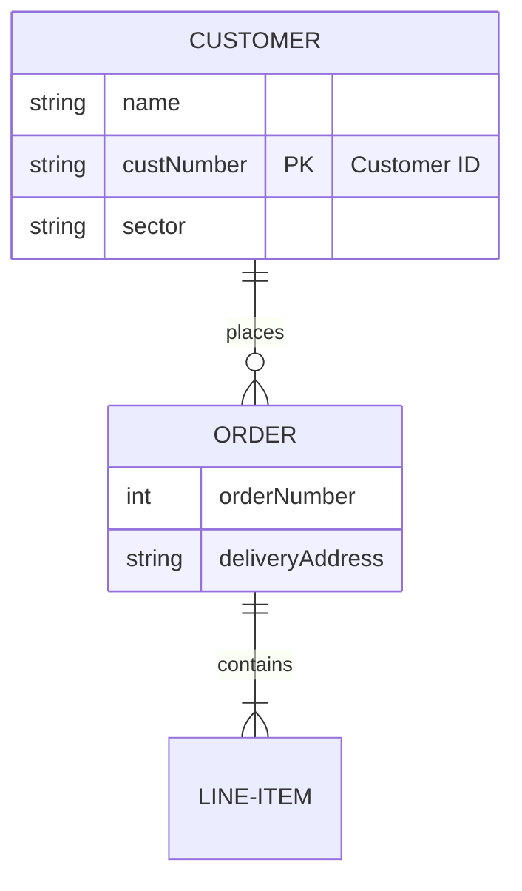


# Entity Relationship diagra example

```mermaid
erDiagram
   
CUSTOMER ||--o{ ORDER : places

CUSTOMER {
    string name 
    string custNumber PK "Customer ID"
    string sector
}

ORDER ||--|{ LINE-ITEM : contains 

ORDER {
    int orderNumber
    string deliveryAddress
}
```
