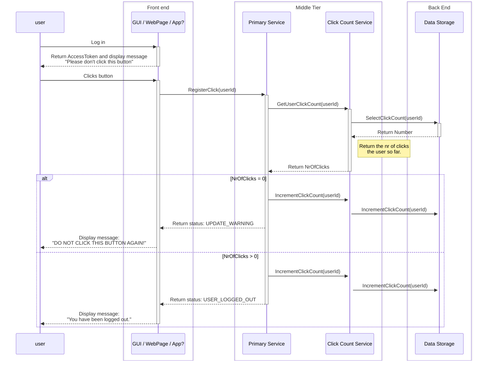

# Sequence Diagram Example

The flow of control and information for a hypothetical use case:

```mermaid
sequenceDiagram

participant U as user
   
box Front end
    participant FE as GUI / WebPage / App?
end

box Middle Tier
    participant Svc as Primary Service
    participant Cc as Click Count Service
end

box Back End
    participant DB as Data Storage
end

###########################
### User logs in 

U->>+FE: Log in
FE-->>-U: Return AccessToken and display message <br />"Please don't click this button"

U->>+FE: Clicks button 
FE->>+Svc: RegisterClick(userId)


    Svc->>+Cc: GetUserClickCount(userId)
    Cc->>+DB: SelectClickCount(userId)
    DB-->>-Cc: Return Number
    Note right of Cc: Return the nr of clicks <br /> the user so far.
    Cc-->>-Svc: Return NrOfClicks

    alt NrOfClicks = 0
        Svc->>+Cc: IncrementClickCount(userId)
        Cc->>+DB: IncrementClickCount(userId)
        Svc-->>FE: Return status: UPDATE_WARNING
        FE-->>U: Display message:<br />"DO NOT CLICK THIS BUTTON AGAIN!"
    else NrOfClicks > 0
        Svc->>+Cc: IncrementClickCount(userId)
        Cc->>+DB: IncrementClickCount(userId)
        Svc-->>-FE: Return status: USER_LOGGED_OUT
        FE-->>-U: Display message:<br />"You have been logged out."
    end
```