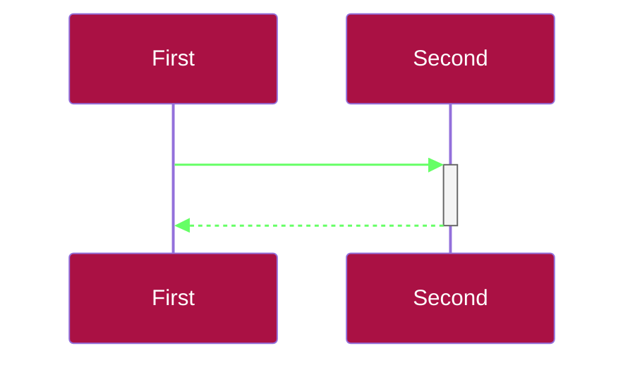

# Basic syntax and usage of mermaid

> ### TLDR:  
> #### In an MD file, add a code block with the language set to `mermaid`.
> &nbsp;

## How and where to add Mermaid "code"

In markdown you can add a code block where you specify e.g. a programming or script language, and this will cause your code to be formatted to suit the structure of that language.

Mermaid uses this same principle, and all mermaid diagrams are created within the following basic structure:
    
    ````mermaid
    <Diagram-type-name>

    <Optional Configuration (theme, colours, etc)> 

    <Diagram content>
    ````

### Example: This code...

        ```mermaid
        sequenceDiagram

        %%{
            init: {
                'themeVariables': {
                    'actorBkg': '#aa1144',
                    'actorTextColor': '#ffffff',
                    'signalTextColor': '#ffffff',
                    'signalColor': '#66ff66'
                }
            }
        }%%

        participant A as First
        participant B as Second
        A->>+B:  Message
        B-->>-A:  Response
        ```

### ...produces this diagram:



### Beyond this, there are separate syntax rules for each separate diagram type.

