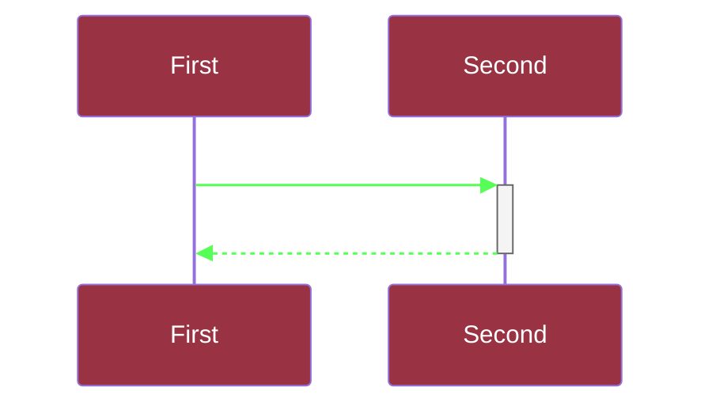

# Basic syntax and usage of mermaid

## Where to add Mermaid "code"

Mermaid diagrams are created in code blocks in markdown documents using the following basic structure:

### Basic format
    
    ````mermaid
    <Diagram-type>

    <Optional Configuration (theme, colours, etc)> 

    <Diagram content>
    ````

### Example: This code...

        ```mermaid
        sequenceDiagram

        %%{
            init: {
                'themeVariables': {
                    'actorBkg': '#991144',
                    'actorTextColor': '#ffffff',
                    'signalTextColor': '#ffffff',
                    'signalColor': '#66ff66'
                }
            }
        }%%

        participant A as First
        participant B as Second
        A->>+B:  Message
        B-->>-A:  Response
        ```

### ...produces this diagram:



### Beyond this, there are separate syntax rules for each separate diagram type.

